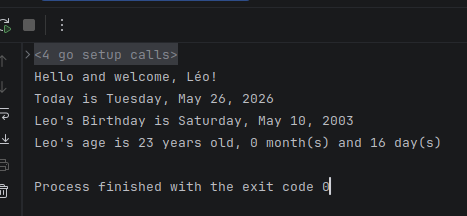

|                          Language Go                          |              Python               |
|:-------------------------------------------------------------:|:---------------------------------:|
|                            compilé                            | interprété (couche intermediaire) |
|                           C++ / C#                            |          syntaxe facile           |
|                Simplicité (à écrire et à lire)                |           presque tout            |
|              Rapidité (execution et compilation)              |          /!\ Performance          |
|                 Rigidité pour simplification                  |            complexité             |
|                      => contrainte**s**                       |              rigide               |
|                         concurrence :                         |    re compilé -> modification     |
| - 2 threads processus qui accedent<br/> à la même ressource } |         fuite de mémoire          |
|                       => MEMOIRE (RAM)                        |           => RISQUES !            |
|                     => Données corrompues                     |                                   |
|                => Données bloquées (deadlocks)                |                                   |
|              => Plusieurs taches multi threading              |                                   |

Multi threading => Go routines
Pragmatique :

- 1 seule façon de faire les choses
- Création des bests practices (règles des meilleurs pratiques)

> Avantage : Stabilité et compatibilité
> Inconvénient : Pas de liberté

=> compromis entre performance Rapidité de développement et de compilation
Performances supérieures entre python et JavaScript

mots clé java +/- 50

|          Object          |
|:------------------------:|
| JAVA (garbage collector) |
|       c / C# / C++       |
|       => Heritage        |
|         classes          |
|      => COMPOSITION      |

|  Objectif  |
|:----------:|
| Bas niveau |
|    Web     |
|   Mobile   |

# Lancer le run

```go
    go run hello.go
```

# Exo age

```go
package main

import (
	"fmt"
	"time"
)

func main() {
	s := "Léo"
	now := time.Now()
	leoBirthday := time.Date(2003, time.May, 10, 00, 15, 0, 0, time.UTC)

	// Calcul des années
	leoAgeYears := now.Year() - leoBirthday.Year()
	if now.Month() < leoBirthday.Month() || (now.Month() == leoBirthday.Month() && now.Day() < leoBirthday.Day()) {
		leoAgeYears--
	}

	// Calcul des mois
	temp := leoBirthday.AddDate(leoAgeYears, 0, 0)
	leoAgeMonths := int(now.Month() - temp.Month())
	if now.Day() < temp.Day() {
		leoAgeMonths--
	}

	// Calcul des jours
	temp = leoBirthday.AddDate(leoAgeYears, leoAgeMonths, 0)
	leoAgeDays := now.Day() - temp.Day()

	fmt.Printf("Hello and welcome, %s!\n", s)
	fmt.Printf("Today is %s\n", now.Format("Monday, January 2, 2006"))
	fmt.Printf("Leo's Birthday is %s\n", leoBirthday.Format("Monday, January 2, 2006"))
	fmt.Printf("Leo's age is %d years old, %d month(s) and %d day(s)\n", leoAgeYears, leoAgeMonths, leoAgeDays)
}
```

> résultat : 

# Explications

## commande 'go run'

La commande `go run` compile et exécute le code source Go en une seule étape.
Il ne fournit pas de fichier exécutable séparé, mais exécute directement le code après la compilation.

## commande 'go build'

La commande `go build` compile le code source Go et génère un exécutable. Par défaut, l'exécutable porte le même nom que
le fichier source (sans l'extension .go).

> Exemple : `go build main.go` génère un exécutable nommé `main` (ou `main.exe` sur Windows).
> Options : go build [-o output] [build flags] [packages]
> - `[build flags]` : Permet d'ajouter des options supplémentaires pour la compilation, telles que des variables
    d'environnement ou des options de compilation spécifiques.
> - `[packages]` : Permet de spécifier les packages à inclure dans la compilation. Par exemple,
    `go build -o myapp ./...`
    compilera tous les packages du projet.

## commande 'go build -ldflags "-s -w" hello.go'

La commande `go build -ldflags "-s -w" hello.go` compile le code source `hello.go` en un exécutable tout en utilisant
les options de l'éditeur de liens (`-ldflags`) pour réduire la taille de l'exécutable.

- `-s` : Supprime les symboles de débogage, ce qui réduit la taille de l'exécutable.
- `-w` : Supprime les informations de la table de symboles, ce qui réduit encore plus la taille de l'exécutable.
  En utilisant ces options, l'exécutable généré sera plus petit, mais il ne contiendra pas d'informations de débogage,
  ce qui peut rendre le débogage plus difficile.
- `hello.go` : Spécifie le fichier source à compiler.
- `-o output` : Permet de spécifier un nom personnalisé pour l'exécutable généré.

# Types en GO

## entiers

| Type   | Taille (bits) | Plage de valeurs (signé)                               | Plage de valeurs (non signé)   |
|--------|---------------|--------------------------------------------------------|--------------------------------|
| int8   | 8             | -128 à 127                                             | 0 à 255                        |
| int16  | 16            | -32,768 à 32,767                                       | 0 à 65,535                     |
| int32  | 32            | -2,147,483,648 à 2,147,483,647                         | 0 à 4,294,967,295              |
| int64  | 64            | -9,223,372,036,854,775,808 à 9,223,372,036,854,775,807 | 0 à 18,446,744,073,709,551,615 |
| uint8  | 8             | N/A                                                    | 0 à 255                        |
| uint16 | 16            | N/A                                                    | 0 à 65,535                     |
| uint32 | 32            | N/A                                                    | 0 à 4,294,967,295              |
| uint64 | 64            | N/A                                                    | 0 à 18,446,744,073,709,551,615 |

## flottants

| Type    | Taille (bits) | Plage de valeurs approximative                                                 |
|---------|---------------|--------------------------------------------------------------------------------|
| float32 | 32            | ±1.5 × 10^−45 à ±3.4 × 10^38 (précision d'environ 7 chiffres significatifs)    |
| float64 | 64            | ±5.0 × 10^−324 à ±1.7 × 10^308 (précision d'environ 15 chiffres significatifs) |

## booléens

| Type | Taille (bits) | Valeurs possibles | Exemple                 |
|------|---------------|-------------------|-------------------------|
| bool | 1             | true, false       | var isGoFun bool = true |

## chaînes de caractères

| Type   | Taille (bits) | Description                                                                                                                                                                                                     | Exemple                               |
|--------|---------------|-----------------------------------------------------------------------------------------------------------------------------------------------------------------------------------------------------------------|---------------------------------------|
| string | variable      | Représente une séquence de caractères Unicode. Les chaînes sont immuables et peuvent contenir des caractères multibytes.                                                                                        | var greeting string = "Hello, World!" |
| byte   | uint 8        | Représente un octet (8 bits) et est souvent utilisé pour manipuler des données binaires ou des caractères ASCII.                                                                                                | var data []byte = []byte("Hello")     |
| rune   | int 32        | Représente un point de code Unicode et est utilisé pour manipuler des caractères Unicode individuels. Un rune peut représenter n'importe quel caractère Unicode, y compris ceux qui nécessitent plus de 8 bits. | var char rune = 'A'                   |

Les strings sont indexables :

- recherche
- optimisation

## Nullable

| Type | Taille (bits) | Description                                                                                                                                                                           | Exemple                     |
|------|---------------|---------------------------------------------------------------------------------------------------------------------------------------------------------------------------------------|-----------------------------|
| Nil  | N/A           | Représente l'absence de valeur ou une valeur nulle. Utilisé pour indiquer qu'une variable n'a pas été initialisée ou qu'elle ne contient pas de données valides.                      | var ptr *int = nil          |
| ""   | N/A           | Représente une chaîne de caractères vide. Contrairement à nil, une chaîne vide est une valeur valide qui indique que la variable a été initialisée, mais ne contient aucun caractère. | var emptyString string = "" |


# Initialisation d'une variable

> var => déclaration d'une variable
> := => déclaration et initialisation d'une variable (type inference)

# Déclaration d'une constante

> const => déclaration d'une constante

> constante de type iota permet de générer des constantes incrémentales automatiquement, souvent utilisées pour les énumérations.